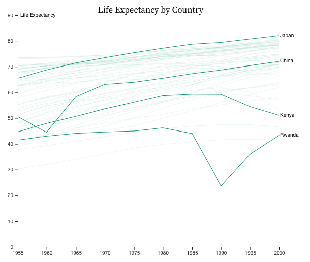

# Color - Exercise

Original Observable notebook can be found [here](https://observablehq.com/d/80992086c9c9d047).

In this exercise, we have created visualizations that do not have any color. Your task is to add appropriate color to them.

| Original | With Color | 
| :-: | :-: |
|    |  | 
|    |  |
|    |  | 
|    |  |
|  |  | 
|   |  |

# Running the Code
> The following was auto-generated by Observable.

View this notebook in your browser by running a web server in this folder. For
example:

~~~sh
python -m SimpleHTTPServer
~~~

Or, use the [Observable Runtime](https://github.com/observablehq/runtime) to
import this module directly into your application. To npm install:

~~~sh
npm install @observablehq/runtime@4
npm install https://api.observablehq.com/d/80992086c9c9d047.tgz?v=3
~~~

Then, import your notebook and the runtime as:

~~~js
import {Runtime, Inspector} from "@observablehq/runtime";
import define from "80992086c9c9d047";
~~~

To log the value of the cell named “foo”:

~~~js
const runtime = new Runtime();
const main = runtime.module(define);
main.value("foo").then(value => console.log(value));
~~~
