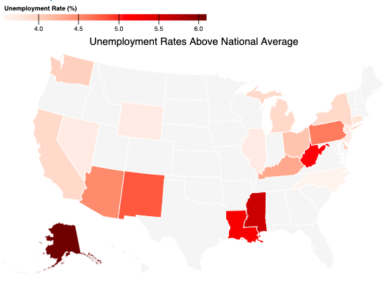

# Graphical Encoding - Exercise

Original Observable notebook can be found [here](https://observablehq.com/d/1e9302e360db6008@1198).

In this exercise, we have a dataset that contains the unemployment rate for each state for December 2019. Your task is to visualize this data in 5 different ways. This exercise is about exploring possibilities, so it's okay if some of your visualizations aren't the most effective.

|  |  |  |
| :-: | :-: | :-: |
| Matrix | Diverging Bar Chart | Horizontal Bar Chart |
|  |  |  |
| Choropleth Map | Worst Rates (1/2) | Best Rates (2/2) |

# Running the Code
> The following was auto-generated by Observable.

View this notebook in your browser by running a web server in this folder. For
example:

~~~sh
python -m SimpleHTTPServer
~~~

Or, use the [Observable Runtime](https://github.com/observablehq/runtime) to
import this module directly into your application. To npm install:

~~~sh
npm install @observablehq/runtime@4
npm install https://api.observablehq.com/d/1e9302e360db6008.tgz?v=3
~~~

Then, import your notebook and the runtime as:

~~~js
import {Runtime, Inspector} from "@observablehq/runtime";
import define from "1e9302e360db6008";
~~~

To log the value of the cell named “foo”:

~~~js
const runtime = new Runtime();
const main = runtime.module(define);
main.value("foo").then(value => console.log(value));
~~~
