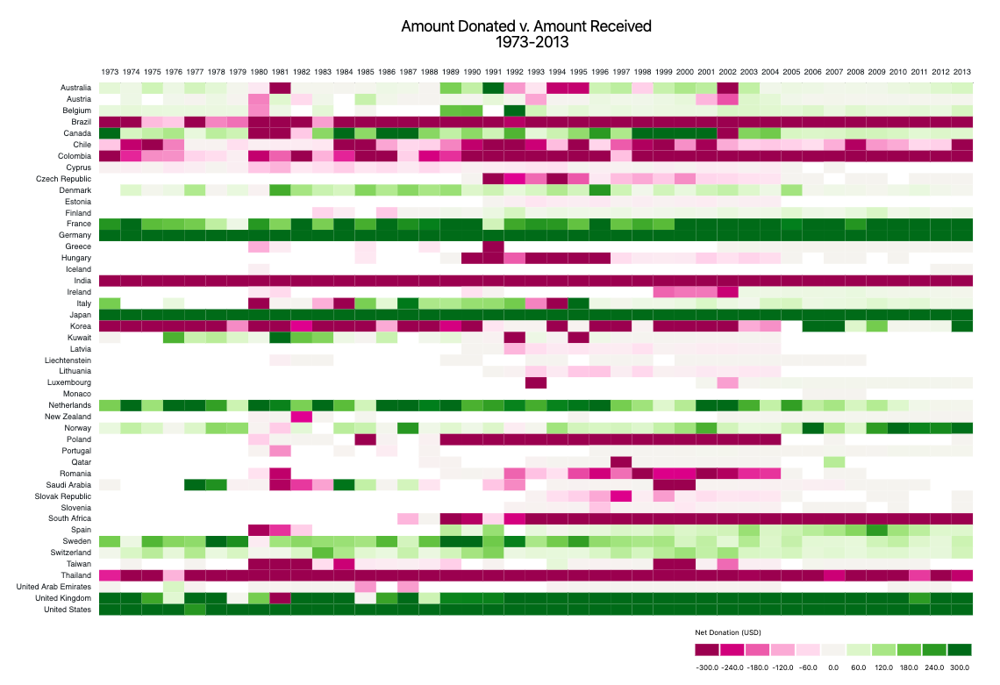

# Goal
To create 3 independent visualizations of the same data set, each one with the intent of answering the questions stated below. For each numbered visualization, you should be able to create a data visualization that answers all of the questions specified.

# Visualizations
### Vis 1 
<ul><li>How does the amount donated vs. amount received change over time across all countries?</li><li>Are there countries that mostly send or mostly receive and countries that have a similar amount of donations they receive and send?</li><li>Are there countries that change their role over time? That is, they used to mostly send donations and turn into mostly receiving donations and vice-versa?</li><li>Are there countries in which you can find a sudden increase ("peak") or a sudden decrease ("valley")?</li></ul>



### Vis 2
<ul><li>Focus on the top 10 “Coalesced Purposes” of donations (in terms of amount of disbursement across all countries and all time). What are the top 10 purposes of disbursements (in terms of total amount of disbursement)?</li><li> How does their relative amount compare over time? E.g., are there purposes that tend to be prominent for a period of time and others that become more prominent during other periods?</li></ul>

> *Hint: looking at the graph one should be able to observe: “Ah! During these years donations were mostly about X but then there were way more donations about Y”.* 

*Coming Soon*

### Vis 3
<ul><li>Focusing exclusively on countries that receive donations, how do donations shift geographically over time? </li><li>Do donations tend to be always in the same regions of the world over the years or they have been shifting over time? </li> Can you build a visualization that shows the “history of donations” so that one can get a sense of which regions of the world have had more need for donations over the years? </li></ul> 

*Coming Soon*

# Running Code
Code derived from [NYU Info Vis](https://github.com/nyuvis/info-vis-project-template) template.

To view `d3` visualizations, a local server must be created. This can be done by navigating to this directory and running:
```python
# For Python 3:
python -m http.server
```
The website will be viewable at [http://localhost:8000/](http://localhost:8000/).
