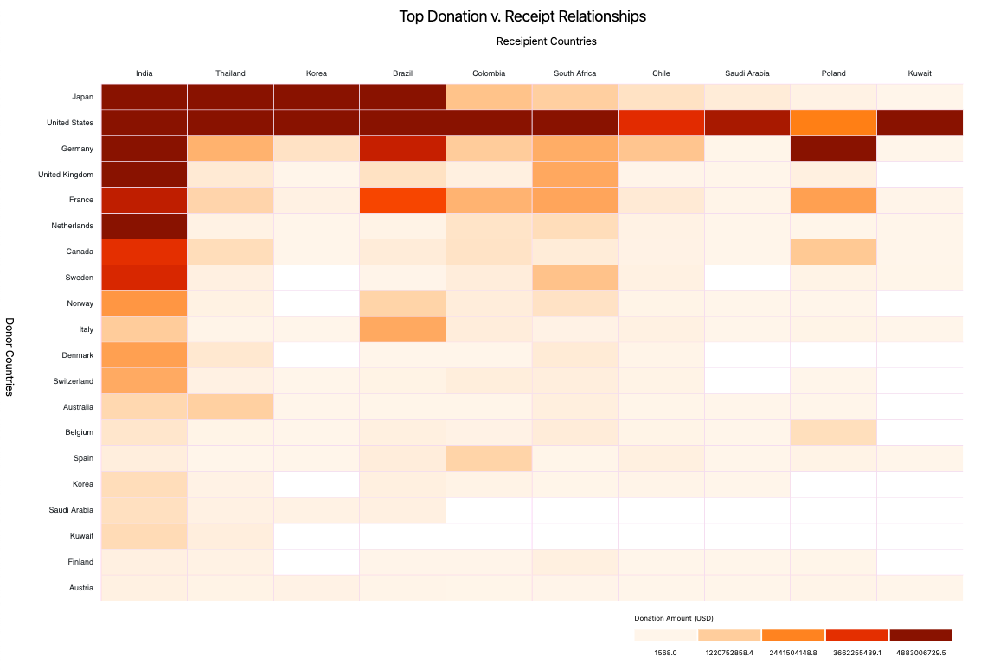

# Goal
To create 3 independent visualizations of the same data set, each one with the intent of answering the questions stated below. For each numbered visualization, you should be able to create a data visualization that answers all of the questions specified.

# Running Code
Code derived from [NYU Info Vis](https://github.com/nyuvis/info-vis-project-template) template.

To view `d3` visualizations, a local server must be created. This can be done by navigating to this directory and running:
```python
# For Python 3:
python -m http.server
```
The website will be viewable at [http://localhost:8000/](http://localhost:8000/).

# Visualizations
### [`Vis 1`](https://github.com/mkarroqe/Info-Vis/blob/master/Mini-Projects/03-Networks/visualizations/vis1.js) 

Create an overview of the relationships between countries so that it is possible to see who donates to whom and how much. The main question one should be able to answer is:
<ul>
  <li>Who are the major donors and to which countries do they donate the most and how much?</li>
  <li>Conversely, who are the major receivers and which countries do they receive from the most and how much?</li>
</ul>

We only care about the top 10 recipients and the top 20 donors over time for this question.

|  |  |
| :-: | :-: |
| With Grid | Without Grid |

> It's much easier to distinguish between low value and empty cells with the gridlines added, making it the superior visualization.

### [`Vis 2`](https://github.com/mkarroqe/Info-Vis/blob/master/Mini-Projects/03-Networks/visualizations/vis2.js)
<ul>
  <li>Considering only the top 5 purposes of donation, how does the relationship between countries look like in terms of purposes? What composition of  purposes do the donations between each pair of countries have?</li>
  <li>Are there countries that donate to a given country using multiple purposes? Or do counties always donate using one single purpose when donating to another country?</li>
</ul>

The same as the previous question, we only care about the top 10 recipients and the top 20 donors here.

> *Coming Soon*
